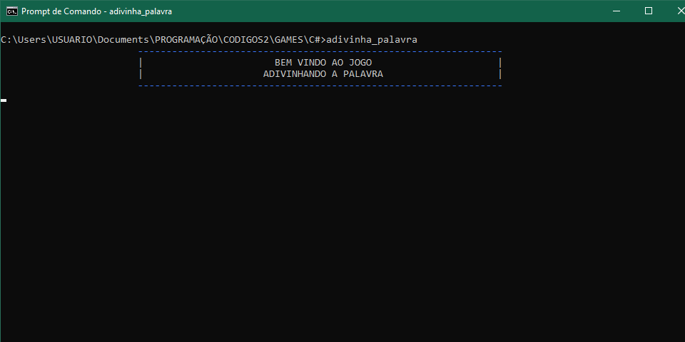
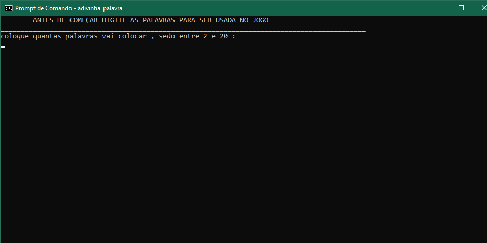
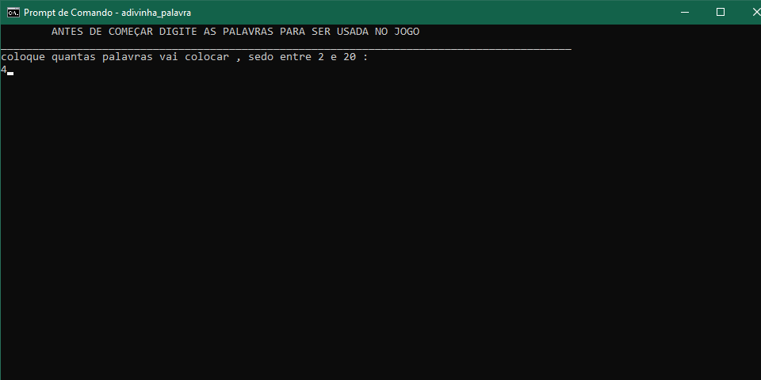
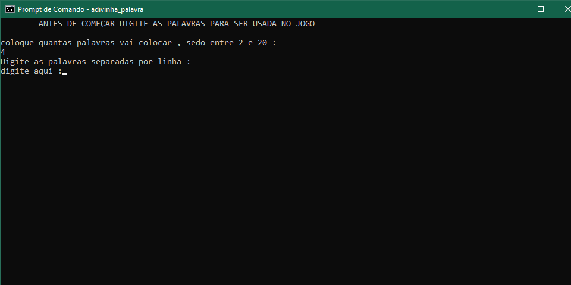
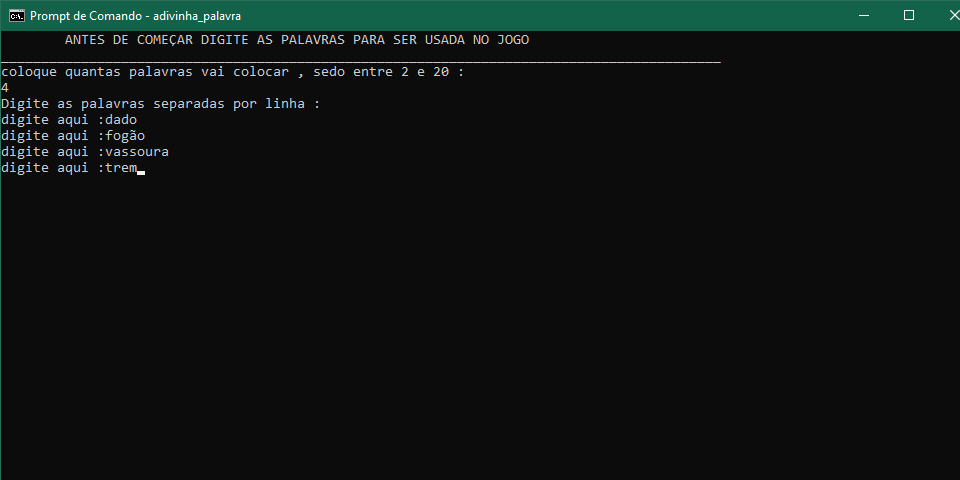
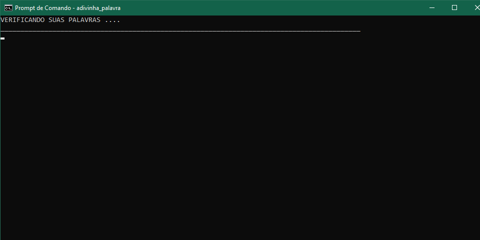
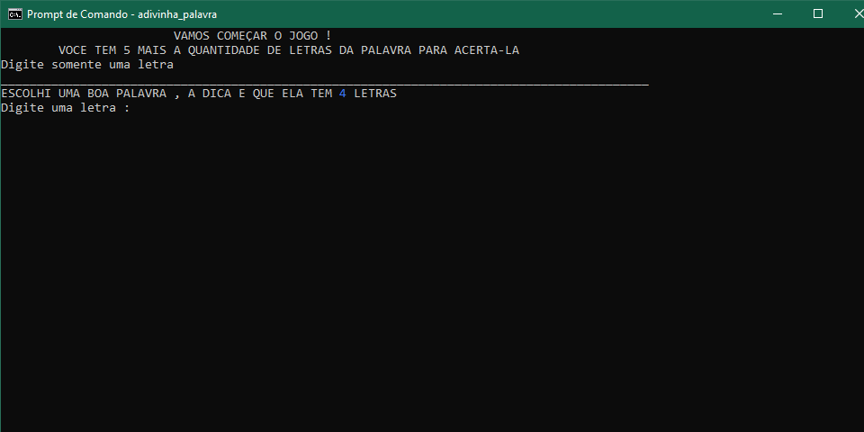
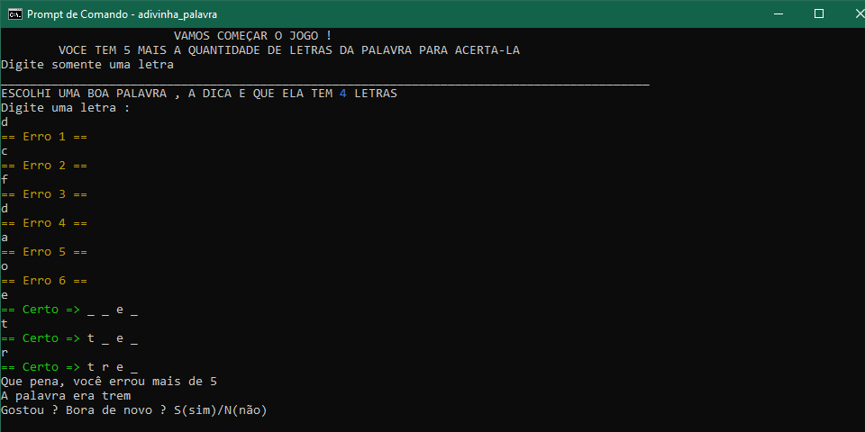

# PLOOP 
  Jogo desenvolvido em python , objetivo e não deixar a bola encostar na borda inferior da tela . 
  Ao passar do tempo e aumentado a velocidade de movimento da bola .
  No fim da partida terá 3 mesagens de acordo com a pontuação .
  
  # IMAGENS 
  

   
    
   
   

 
 

# SNAKE
  Jogo desenvolvido em python , objetivo e sobreviver o maior tempo possivel .
  Ao passar do tempo e acrescentado +1 nivel assim a velocidade tambem .
  No fim da partida tem a sua pontuação e caso tenha tentado mais de uma vez sem fechar o programa , terá o placar das 3 maiores pontuações .

# IMAGENS

   
    
    
   
   

  
 
    OBS : Caso queira testar , baixe a paleta de cores para não da erro ou coloque a cor manualmente 
    
  

# ADIVINHA A PALAVRA
  Jogo desenvolvido em c# , ainda e de prompt de comando , mas não deixa de ser um jogo bem legal . 
  Permite o usuario colocar uma lista de palavras de 2 a 20 , onde uma sera escolhida aleatoriamente para ser adivinhada , entretanto so pode colocar letras senão não passa pela verificação ;) . 
  O usuario tera o numero de letras da palavra mais 5 de tentativas para conseguir acertar .
  O jogo pode ser jogado varias vezes com a mesma lista , mas tambem pode ser alterada ao fim de uma partida .
  

# IMAGENS
  

    
    
   
    
   
   
   
   

  

# PARTICIPANDO 
  Fique a vontade para participar , caso tenha ideias e quer melhora-los , entre em contato comigo no discord ou talvez esta desenvolvendo algum e quer ajuda so chamar :sunglasses:
  + DOUGVIKT#9526
